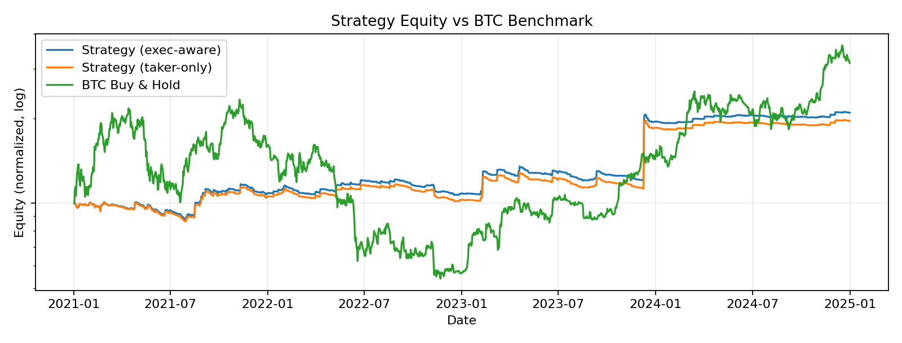
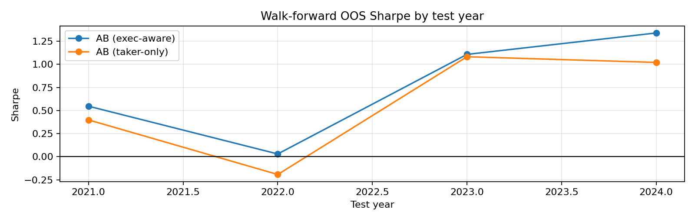
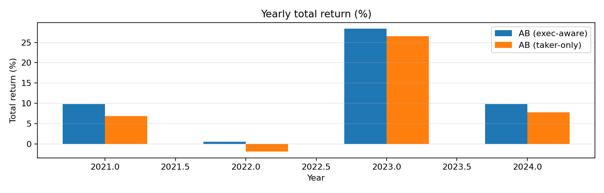
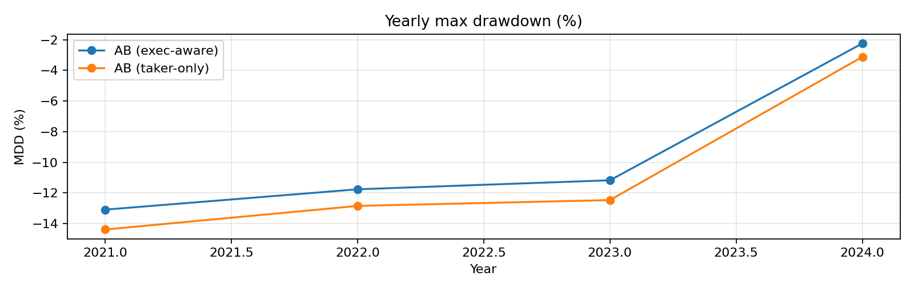

# Remote Crypto Quant / Trader Portfolio (WRSE)

This document follows a submission-style structure. It is intended to be exported to PDF if needed.

Links:
- Dashboard: https://hoioioio.github.io/WRSE-QUANT-ENGINE/
- Data schema / reproducibility: [reproducibility.md](reproducibility.md)
- GitHub: [Repository root](../)

## Executive Summary (1p)

WRSE is a systematic crypto futures (perps) research/backtesting engine. It emphasizes walk-forward out-of-sample (OOS) evaluation and execution-aware simulation assumptions (fees, slippage, funding, maker→taker fallback). This document is for research/portfolio purposes and is not investment advice.

Key public OOS results (2021–2024):
- AB Hybrid (exec-aware): Total +55.74%, CAGR 11.74%, MDD -11.99%, Sharpe 0.78
- Taker-only (stress): Total +43.10%, CAGR 9.39%, MDD -12.73%, Sharpe 0.64

Quant Portfolio Flow:

```text
Market Research
  -> Strategy Research
  -> Backtesting
  -> Portfolio Construction
  -> Risk Management
  -> Execution
  -> Walk-forward & Validation
  -> Live / Paper Trading
  -> Performance Analysis
```

Contents:
- [Executive Summary (1p)](#executive-summary-1p)
- [1. Introduction](#1-introduction)
- [2. Trading System Architecture](#2-trading-system-architecture)
- [3. Market Research](#3-market-research)
- [4. Strategy Research](#4-strategy-research)
- [5. Backtesting Framework](#5-backtesting-framework)
- [6. Portfolio Construction](#6-portfolio-construction)
- [7. Risk Management](#7-risk-management)
- [8. Execution System](#8-execution-system)
- [9. Walk-forward & Validation](#9-walk-forward--validation)
- [10. Live Trading / Paper Trading](#10-live-trading--paper-trading)
- [11. Performance Analysis](#11-performance-analysis)
- [12. Conclusion](#12-conclusion)
- [13. GitHub Repository](#13-github-repository)

## 1. Introduction

WRSE is a systematic crypto futures research/backtesting engine for Binance-style perpetuals.
The public artifacts focus on walk-forward out-of-sample (OOS) evaluation and execution-aware simulation assumptions.

Scope:
- Market: crypto futures (perps)
- Instruments: multi-asset universe configured via TOML
- Validation: walk-forward OOS splits (train -> lock params/weights -> test)

Non-scope (public repo):
- Raw market data (size/licensing)
- Private trade-level logs and live API keys

## 2. Trading System Architecture

High-level pipeline:

```text
Market Data (OHLCV / funding / L2 summaries)
  -> Cache Storage
  -> Feature/Signal (Trend + ShockScore)
  -> Walk-forward (train -> lock params/weights -> OOS test)
  -> Simulator (fees/slippage/funding + maker->taker fallback)
  -> Metrics + Report (figures + docs/assets_public/*.json)
  -> Dashboard (docs/index.html)
```

Key modules:
- Signals/features: [../alpha/shock.py](../alpha/shock.py)
- Walk-forward engine: [../backtest/walkforward.py](../backtest/walkforward.py)
- Simulator: [../backtest/simulators.py](../backtest/simulators.py)
- Execution model: [../execution/models.py](../execution/models.py)
- Reporting: [../report.py](../report.py)

## 3. Market Research

### 3.1 Data, Universe & Assumptions

Cache inputs (see [reproducibility.md](reproducibility.md) for details):
- OHLCV (required): `bt_{SYMBOL}_{timeframe}.pkl` with `open/high/low/close/volume`
- Funding (optional): `funding_{SYMBOL}.pkl` with `fundingTime`, `fundingRate`
- L2 summaries (optional): `l2_{SYMBOL}_{timeframe}.csv` with `spread_bps`, `micro_dev_bps` (or derivable columns), `imb`

Assumptions and bias controls:
- Timestamps are treated as timezone-naive after loading.
- Cache timeframe (e.g., 15m) is internally resampled to 4h for signal/risk logic.
- Missing inputs: funding defaults to 0; missing L2 triggers a simplified execution fallback.
- No look-ahead: parameters and weights are selected on train windows only and locked on test (OOS).
- Universe survivorship (listings/delistings) is treated as a data-prep concern in the public version.

### 3.2 Research Focus & Hypotheses

Crypto futures (e.g., Binance Perps) exhibit distinct microstructure characteristics driven by retail leverage and 24/7 liquidation engines. This portfolio bases its system design on three core data-driven hypotheses.

**Observation 1: Retail Leverage and Funding Rate Imbalances**
- **Data Observation**: Periods of extreme positive funding rates indicate an overcrowded long leverage consensus.
- **Hypothesis**: When momentum decelerates during extreme funding rate premiums, the probability of a long-squeeze (cascade liquidation) increases significantly. Trend-following entries should be suppressed here due to negative expected value.

**Observation 2: Liquidation Cascades and Volatility Clustering**
- **Data Observation**: Forced liquidations trigger asymmetric volatility spikes, creating clustered regimes of high and low volatility.
- **Hypothesis**: The initial transition from a low-volatility regime to a high-volatility regime exhibits strong momentum persistence. However, entering during peak "shock" volatility leads to adverse execution costs that destroy theoretical edge.

**Observation 3: Maker-Taker Asymmetry and Execution Friction**
- **Data Observation**: Order book spreads and liquidity imbalances deteriorate sharply during momentum spikes.
- **Hypothesis**: Maker-only backtests suffer from severe adverse selection during fast markets. Strategies must assume Taker execution (or Maker-to-Taker fallback) to reflect realistic out-of-sample (OOS) expectancy.

Public report focuses on event-style stress slices and distribution-style summaries computed from OOS equity based on these hypotheses.

Stress slices (examples):
- LUNA deleveraging (2022-05)
- FTX bankruptcy shock (2022-11)

Distribution slice:
- rolling 6-month return distribution computed from daily equity

Supporting artifacts:
- Equity vs BTC (log scale): [assets_public/equity_vs_btc_log.png](assets_public/equity_vs_btc_log.png)
- WFO OOS Sharpe by year: [assets_public/wfo_oos_sharpe.png](assets_public/wfo_oos_sharpe.png)
- Yearly returns / MDD summary: [assets_public/yearly_returns.png](assets_public/yearly_returns.png), [assets_public/yearly_mdd.png](assets_public/yearly_mdd.png)

Figure 3-1. Equity vs BTC (log)



Figure 3-2. WFO OOS Sharpe by split year



Figure 3-3. Yearly returns (OOS)



Figure 3-4. Yearly MDD (OOS)



## 4. Strategy Research

Based on the hypotheses derived in Section 3, the system separates logic into a Trend-following component and a Shock-avoidance component, which are then combined via walk-forward weight selection.

Strategy template (per strategy):
- Strategy idea & Hypothesis Link
- Signal definition (features/filters)
- Entry/Exit rules
- Position sizing / risk control
- Backtest result (WFO OOS)

### 4.1 Trend component

Summary and Hypothesis Link:
- **Hypothesis Link**: Captures momentum during volatility expansion (Observation 2) while actively avoiding entries during funding rate extremes (Observation 1).
- **Features**: Uses higher timeframe bars internally (resampled to 4h from cache timeframe) to reduce noise.
- **Entry**: Enters when short/mid-term reversal aligns with a longer-term baseline direction.
- **Filters**: Uses filters (volatility/ADX) to avoid range-bound markets, and funding rate caps to control participation in overcrowded regimes.

### 4.2 Shock component (ShockScore)

Summary and Hypothesis Link:
- **Hypothesis Link**: Extreme jump events and liquidity vacuums destroy maker-execution value. The system must recognize these states and step aside (Observations 2 & 3).
- **Training**: Labels jump events and trains a Ridge-based signed classifier on the train window.
- **Inference**: On the test window, it only infers `shock_score` (no re-training).
- **Application**: Used for entry avoidance (vetoing Trend signals), de-risking, and execution conservatism when the score exceeds threshold.

### 4.3 Ensemble (Trend + Shock)

Summary:
- Searches `weights_grid` on the train window.
- Locks the selected weight for the subsequent test year.

## 5. Backtesting Framework

Backtest is designed to include common sources of live-trading performance decay:
- Bar-based time-step simulation (positions, funding accrual, exits processed over time)
- Fees (maker/taker)
- Slippage
- Funding rates (if cache exists; otherwise assumed 0)
- Unfilled limit orders via maker→taker fallback execution model
- Multi-asset portfolio simulation
- Walk-forward OOS-only accumulation
- Parameter/weight selection limited to train windows (`weights_grid`, `v2_param_samples`)

Key implementations:
- Simulator: [../backtest/simulators.py](../backtest/simulators.py)
- WFO runner: [../backtest/walkforward.py](../backtest/walkforward.py)
- Config: [../config/strategy_params.example.toml](../config/strategy_params.example.toml)

Execution/cost parameters (examples):
- `[execution].slippage_bps`
- `[execution].maker_fee_rate`, `[execution].taker_fee_rate`
- `[execution].exec_mode` (e.g., `maker_then_taker`)

## 6. Portfolio Construction

Universe and portfolio rules are specified in TOML:
- Symbols: `[data].symbols`
- Max concurrent positions: `[risk].portfolio_slots`
- Trend/Shock allocation: `[walk_forward].weights_grid` (selected on train, locked on test)

Reference:
- Example config: [../config/strategy_params.example.toml](../config/strategy_params.example.toml)

Current public version (summary):
- Multi-asset portfolio with slot limits
- Risk-per-trade sizing (`risk_per_trade`)
- Trend/Shock blend weight selected via walk-forward and locked per test split

## 7. Risk Management

Public configuration and logic cover:
- Risk-per-trade sizing (`risk_per_trade`)
- Stop-loss parameters for components (`stop_loss_pct_trend`, `stop_loss_pct_shock`)
- Portfolio slots (concentration control)
- Drawdown-based scaling (risk reduction under drawdown states)
- Funding risk suppression (if funding cache exists)

Reference:
- Config: [../config/strategy_params.example.toml](../config/strategy_params.example.toml)
- Walk-forward logic: [../backtest/walkforward.py](../backtest/walkforward.py)

## 8. Execution System

Execution model is explicitly simulated as part of backtesting:
- Maker attempts with L2 summary features if available
- Fallback to taker if unfilled (costlier fill assumption)
- Slippage and fees applied according to mode

Included in the public version (summary):
- Maker/taker fee differentiation
- Slippage (bps) assumption
- Maker unfilled → taker fallback rule

Reference:
- Execution model: [../execution/models.py](../execution/models.py)
- Data schema (L2 summaries): [reproducibility.md](reproducibility.md)

## 9. Walk-forward & Validation

Validation rules:
- OOS-only accumulation (reporting focuses on test windows)
- Parameters and ensemble weights are derived from train windows only
- Split-by-year testing over the configured years

Artifacts:
- WFO splits table: [assets_public/wfo_splits.json](assets_public/wfo_splits.json)
- WFO OOS Sharpe plot: [assets_public/wfo_oos_sharpe.png](assets_public/wfo_oos_sharpe.png)

## 10. Live Trading / Paper Trading

This repository does not include live API keys or complete order logs.

Operational principles used in predecessor live systems:
- Exchange ledger as source of truth
- Reconciliation cycle for positions and open orders
- Use of idempotent order keys

## 11. Performance Analysis

### 11.1 WFO OOS summary (2021–2024)

Table 11-1. WFO OOS Summary (public)

| Metric | AB Hybrid (exec-aware) | Taker-only (stress) |
| :--- | :---: | :---: |
| Cumulative Return | +55.74% | +43.10% |
| CAGR | 11.74% | 9.39% |
| MDD | -11.99% | -12.73% |
| Sharpe | 0.78 | 0.64 |
| Trading Days | 1,457 | 1,457 |

Equity curves:
- [assets_public/equity_ab.json](assets_public/equity_ab.json)
- [assets_public/equity_ab_taker.json](assets_public/equity_ab_taker.json)

Figure:
- [assets_public/equity_vs_btc_log.png](assets_public/equity_vs_btc_log.png)

### 11.2 Stress tests

Representative OOS event slices:
- LUNA deleveraging: 2022-05-07 ~ 2022-06-30
- FTX bankruptcy shock: 2022-11-06 ~ 2022-12-31

### 11.3 Notes on public metrics

- Trade-level logs are not included in the public repo.
- A public run reproduces the dashboard artifacts when the same cache data is provided.

### 11.4 Monitoring, Ops & Post-trade Analytics

Operational artifacts available in the public repo:
- Artifact integrity checks: [../integrity_check.py](../integrity_check.py)
- Published equity summary verification: [../verify_portfolio.py](../verify_portfolio.py)

Optional for paper/live submissions:
- Attribution by strategy/symbol
- Execution quality summary (fees/slippage)
- Monitoring/alerts for state synchronization anomalies

## 12. Conclusion

The public deliverables demonstrate:
- Walk-forward OOS evaluation with locked parameters/weights per split
- Execution-aware simulation assumptions (fees/slippage/funding + maker→taker fallback)
- Reproducible reporting artifacts used by a static dashboard

Limitations:
- Raw market data not included
- No live keys / complete order logs in repository

Failure modes (examples) and mitigations:
- Regime shifts causing parameter degradation: evaluated via split-by-year walk-forward OOS reporting.
- Underestimated execution friction: AB Hybrid vs Taker-only sensitivity is reported.
- Data quality/missing inputs: schema is explicit; missing funding/L2 triggers documented fallbacks.
- Overfitting risk: search is restricted to train windows; robustness extensions (bootstrap/sensitivity) are separated as future work.

## 13. GitHub Repository

Entry points:
- Run evaluation: [../cli.py](../cli.py)
- Generate dashboard artifacts: [../report.py](../report.py)
- Validate published equity summaries: [../verify_portfolio.py](../verify_portfolio.py)

How to reproduce:
- Follow [reproducibility.md](reproducibility.md) to prepare cache inputs
- Run the commands listed in README
